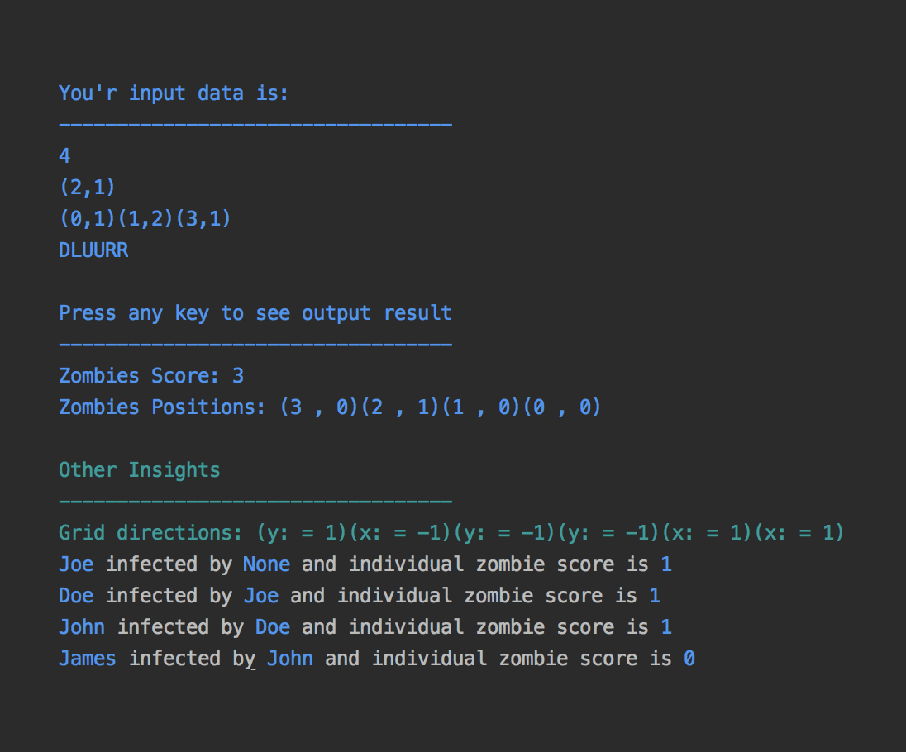

# Zombie Apocalypse v4.1

To run this must install node version `v8.11.1`

From root directory run `npm install` this will install node modules, which needed to run this program

To start `npm start src/input.txt`

It will show the input from file and ask to hit any key to show results

*Sample output:*

After the nuclear war, a strange and deadly virus has infected the planet. Living creatures
are becoming zombies that spread their zombiness by an unfriendly bite. The world consists
of an n x n grid on which zombies and creatures live. Both of these occupy a single
square on the grid and can be addressed using zero-indexed x-y coordinates. Top left corner
is (x: 0, y: 0) with x represent horizontal coordinate, y represent vertical coordinate. Any
number of zombies and creatures may occupy the same grid square.

At the beginning of the program a single zombie awakes and begins to move around the
grid. It is given an initial x-y coordinate and a list of movements, up, down, left and right ( U ,
D , L , R ). The ordered sequence of movements is represented as a string, for example:
DLUURR (down, left, up, up, right, right) . Zombies can move through the edge of the grid,
appearing on the directly opposite side. For a 10x10 grid, a zombie moving left for (0,4) will
move to (9,4); a zombie moving down from (3,9) will move to (3,0).

The poor creatures in the area are the zombie’s victims. The also have an initial x-y
coordinate. The creatures are aware of zombie presence, but are so frightened that they
never move

If a zombie moves so that it end up on the same location as a creature, the creature is
transformed into another zombie and zombies score one point . The zombie continues
moving and infecting creatures until has performed all its moves. Once it has completed its
movement, the first newly created zombie moves using the same sequence as the original
zombie. Once it has completed its move, the second newly created zombie moves, and so in
order of infection with each zombie performing the same sequence of moves. Once no new
zombies have been created and all the zombies have completed moving the program ends.

Your task is to program to take an input txt file about the zombie game and output the result.

Given a file that contains:
- dimensions of the area (N)
- initial position of the zombie
- a list of positions of poor creatures and 
- a list of moves zombies will make

The program output
- the number of points scored by the zombies
- the final position of the zombies

Example input:
4
(2,1)
(0,1)(1,2)(3,1)
DLUURR
Example output:
zombies score: 3
zombies positions: (3,0)(2,1)(1,0)(0,0)

